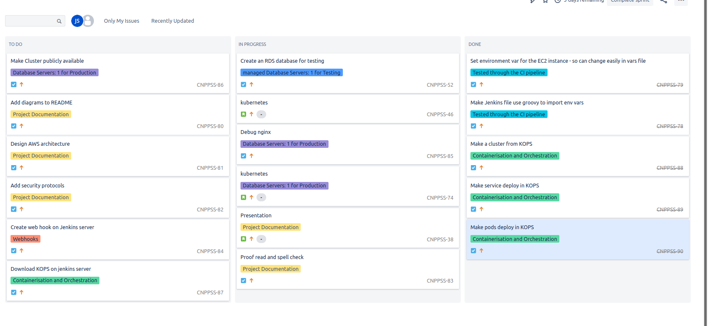

# Practical Project 

## SFIA assessment 2 

- [Introduction](#Introduction)
- [Infrastructure](#Infrastructure)
- [Testing](#Testing)
- [Database](#Database)
- [Risk-Assessment](#Risk-Assessment)
  - [MoSCoW](#MoSCoW-report)
  - [Docker](#Docker)
  - [Cloud-Computing](#Cloud-Computing)
  - [Database-Risks](#Database-Risks)
  - [Network](#Network)
- [References](#References)
 
## Introduction 

SFIA Project 2

This project requires the deployment of an app using a devOps approach.
Using different tools to get the app to deploy through automation is the 
ultimate aim of the project.

## Planning

The project was planned using Atlassian Jira board. The type of planning board used was a 
Scrum board. Scrum boards use sprints, designed to focus the work on tasks and user stories
and provide a sense of progression through. The picture below shows the current state of sprint 
that is being completed. After this MVP will be reached.

### Docker and Docker-Compose 

There are three parts to docker that need to be discussed.

1. Image creation

Using dockerfiles to create environments for the containers to run on.
There are 4 images created in the application: frontend, backend, database and nginx.

The images have their own role to play with in the application, the frontend allows
the users to access the html page and then send a request to the backend. The backend directs
the HTTP request from the front end and retrieves the data back from the database.
The database makes the application stateful my holding the data between sessions 
and makes it available for retrieval. Finally, NGINX acts as a reverse proxy to increase security 
by making the application appear as if it is under the same IP address so potential malicious users 
would only have one IP address to communicate with, not 3. NGINX also acts as a load balancer.

2. Running containers

Once the images have been built they will be run in separate environments on the same machine.
So that the containers can pass data between them, they are placed on the same network this allows 
GET requests to be made from the frontend container to the backend. 

3. Pushing images to Dockerhub 

Images are on Dockerhub, when the application is ran K8S can access the images. 

### Jenkins

#### Pipeline
1. Update the jenkins machine

2. Connect to pytest server

3. Run the pytest on test server

4. save pytest to test server

5. Download kubctl on webserver

6. Run KOPS to make a cluster

7. Initialize pods with the manifest file to run containers

#### Webhook

A webhook was added to the jenkins server. This allows for things to be pushed to the Repository on Github and
then the Jenkins Server will re-run the Jenkins pipeline so that changes that are pushed to the repository will 
be reflected on the test server and the production environment. 

### Ansible

#### Setting up Jenkins Server 

1. installs Jenkins with a script 

#### Setting up the Test Virtual Machine

1. Installs Docker with a script 
2. Installs Docker-Compose with a script

## Infrastructure

### Continuous Integration pipeline

The technologies described above are used to make the process automated. The picture below shows how
the technologies are working together to automate the process.

### Amazon Web Services (AWS)

AWS will be used to put the project into production.
Terraform will be used to create the resources for deployment.

#### EC2 instances

There will be two EC2 instances. The first one will be the Jenkins server, and the second will be the pytest VM.

#### VCP 

##### Route tables

The route table will have port 22 open so that the machines can be accessed through SSH.
The route table will allow access on port 80 so that HTTP requests can be handled by NGINX.

##### Subnets

There are two subnets that will contain the RDS, and the EC2 instances.
The EC2 instance will need to be in the same subnet as the RDS, so the instances can communicate.
The best case scenario would be for the RDS to be in a private subnet and the EC2 being in a public 
subnet. This would make the database more secure as it can't be accessed directly from the internet.

## Testing
 
## Database

### RDS

There are two RDS databases. The RDS should be in a private subnet.
 
### Security

The environment variables within the application are kept secure.

## Risk Assessment

### MoSCoW-report 

#### Must have ...
* Deploy application using docker and docker-compose
* Deploy application using Jenkins
* Test app on Jenkins
* Manage a database using MySQL 
* Make test database using MySQL
* Use Webhooks on Jenkins to redeploy code 
* Use AWS to deploy code on the cloud
* Provision environment using Ansible Playbook
* Use NGINX to make a reverse proxy that hosts the application 

#### Should have ...
* Software designs
* Use a version control system to manage code - Github
* Design for system 
* Logging of deployment of application

#### Could have ...
* Have .gitignore file 
* Logs written for backend
* Evolution of designs 

#### Would have ...
* Tests cover full CRUD application
* code quality is checked 
* Update and analysis of project

### Docker
|Description |Assessment |Risk likelihood of occurring (1=low to 10=high)|Impact (1- 10)|Responsibility|Proposed Mitigation |Risk likelihood of occurring (1 - 10)|Impact (1- 10)|
|--------------------------------------------------------|-----------------------------------------------------------------------------------------------------------------------------------------------------------------------------------------------------------------------------------------------------------------------------------------------------------------------------------------------------------------------------------------------|---|---|----------|-----------------------------------------------------------------------------------------------------------------------------------------------------------------------------------------------------------------------------------------------------------------------------------------------------------------------------------------------------------------------------------------------------|---|---|
|Unrestricted access of process and files                |An attacker who gains access to one container may have the capability to gain access to other containers or the host.                                                                                                                                                                                                                                                                          |3  |9  |Jake Stone|The access control best practice recommendations includes the principle of least privilege. The user namespace feature in Linux containers will allow developers to avoid root access by giving isolated containers separate user accounts, and mandate resource constraints, so users from one container do not have the capability to access other containers or exhaust all resources on the host.|3  |9  |
|Kernel level threats                                    |Docker is designed to have all containers share the same kernel and the host. This provides convenience but also amplifies the impact of any vulnerabilities present in the kernel.                                                                                                                                                                                                            |3  |10 |Jake Stone|restrict applications that run on privileged ports besides the ones that are necessary (e.g. Apache server), since those ports have more access to the kernel.                                                                                                                                                                                                                                       |1  |10 |
|Inconsistent update and patching of docker containers   |Running an older version of Docker containers can expose internal IT environments to higher risks of breach                                                                                                                                                                                                                                                                                    |2  |5  |Jake Stone|a patching policy should be in place and enforced.                                                                                                                                                                                                                                                                                                                                                   |0  |5  |
|Unverified docker images                                |Downloading images that are from an unknown source can lead to malware running on the kernel.                                                                                                                                                                                                                                                                                                  |1  |2  |Jake Stone|download Docker images from trusted sources that are curated by the Docker community. Run vulnerability scans against those images before running them in the host environment.                                                                                                                                                                                                                      |1  |2  |

### Cloud Computing

|Description                                             |Assessment|Risk|Impact|Responsibility|Current Mitigation|Proposed Mitigation|Response|Tolerance|
|--------------------------------------------------------|----------|----|------|-------------|-------------------|--------------------|-------|---------|
|Executives must have oversight over the cloud           |Need to be able to make business decisions based off data from the cloud provider                                                                                                                                                                                                                                                                                                                                                                                                           |9                                             |2             |Jake Stone   |An oversight of the project is seen on github and progression of the project can be seen on Jira board. Over sight over the cloud can be seen on AWS can see how performance of computing resources is doing and can optimize based off data                                                                                                                                                         |9                                   |0             |
|Management must own the risks in the cloud              |Knowing about the risks before developing is always a positive                                                                                                                                                                                                                                                                                                                                                                                                                              |7                                             |6             |Jake Stone   |Learning about cloud at QA academy and cloud academy                                                                                                                                                                                                                                                                                                                                                 |7                                   |1             |
|All necessary staff must have knowledge of the cloud    |If working on something, a base level of competence is always a help                                                                                                                                                                                                                                                                                                                                                                                                                       |4                                             |6             |Jake Stone   |I learn technologies of the cloud, which can be seen on Jira                                                                                                                                                                                                                                                                                                                                         |4                                   |1             |
|Best practices must be followed in the cloud            |People that have came before have ran into problems while developing solutions to the cloud, they must have spent many a long night thinking arguing the compromise between security and speed; authentication requirements and ease of use. After these long thoughts they have come up with a set of requirements that they think are the most appropriate, therefore  as these are the most competent people in this area these practices should be followed unless can be reasoned against|5                                             |6             |Jake Stone   |AWS best security practices read. Report to be written to show following of the AWS security measures                                                                                                                                                                                                                                                                                              |5                                   |1             |
|data theft                                              |People can get to the data in a variety of ways e.g. SQL injection                                                                                                                                                                                                                                                                                                                                                                                                                          |10                                            |8             |AWS          |The data is stored on the sql database on a AWS VM                                                                                                                                                                                                                                                                                                                                                   |10                                  |1             |
|system compromise                                       |The system can go down due to a range of technical problems                                                                                                                                                                                                                                                                                                                                                                                                                                 |9                                             |9             |Jake Stone   |Use jenkins so if a container is to fail Jenkins, an continuous integration pipeline can restart a container                                                                                                                                                                                                                                                                                         |9                                   |2             |

### Database Risks

|Description                                             |Assessment|Risk|Impact|Responsibility|Current Mitigation|Proposed Mitigation|Response|Tolerance|
|--------------------------------------------------------|----------|----|------|-------------|-------------------|--------------------|-------|---------|
|Excessive privileges      |When a malicious user enters the system they will try and get the highest level of access as possible so they may steal the most valuable data. Also, there may be a disgruntled employee that would want to cause havoc if they had unrestricted privileges they could delete all the data.|0  |10 |Jake Stone|Prevention, use NGINX so application is under on IP address, use AWS and follow security guide lines.Damage control use Principle of least privilege so that if event is to occur damage can be minimized                                                                                                                    |0  |1  |
|Legitimate privilege abuse|This is to distinguish between human incompetence and deleting on purpose. There may be a worker whom, by mistake, deletes. shutdown apart of the database.                                                                                                                           |7  |8  |Jake Stone|Make sure a back up of the data is kept so that if data is to be deleted back-up can be used                                                                                                                                                                                                                                  |7  |0  |
|Database injection attacks|This is can be done in many way, but the result is either the deletion of data or data being stolen.                                                                                                                                                                                   |3  |7  |AWS       |S3 bucket will be used to store data, they follow AWS security guide lines.                                                                                                                                                                                                                                                  |1  |7  |
|Malware                   |A piece of software that acts to destroy or steal data from application.                                                                                                                                                                                                               |5  |8  |AWS       |Malware can only attack the EC2 machines the application will be running on. Reducing the likelihood that Malware will be present on a machine is the responsibility of AWS and they follow strict security guidelines.                                                                                                       |1  |8  |
|Storage media exposure    |Back-ups of the data are normally left insecure.                                                                                                                                                                                                                                     |5  |8  |AWS       |AWS will store all backups of data and therefore will be responsible for it. There could be an argument made that AWS could go down and having a backup of this data is could be vital in securing a higher market share, this is false if AWS was to go down people would no longer trust there information on the internet.|1  |8  |
|The human factor          |People thinking they know what they're doing and not doing the correct thing, so they enter the incorrect command and do something catastrophic                                                                                                                                        |8  |10 |Jake Stone|Branching the project and having a test data base will allow for commands to be tested and put into development.                                                                                                                                                                                                              |8  |1  |

### Network

|Description                                             |Assessment|Risk|Impact|Responsibility|Current Mitigation|Proposed Mitigation|Response|Tolerance|
|--------------------------------------------------------|----------|----|------|-------------|-------------------|--------------------|-------|---------|
|Viruses and Worms                   |destructive malicious programs designed to infect core systems, destroying essential system data and making networks inoperable                                                                                               |5                                             |9             |Jake Stone   |Installing anti-malware solutions on all networked devices and systems can significantly reduce the possibility of contracting these viruses or allowing them to spread.                                                                                        |1                                   |9             |
|Botnets                             |powerful networks of compromised machines that can be remotely controlled and used to launch attacks of massive scale                                                                                                         |5                                             |9             |Jake Stone   |defense in this case requires a cooperative approach including working with your ISP, system software vendors, and law enforcement agencies.                                                                                                                     |1                                   |9             |
|Phishing Attacks                    |social engineering attack that is designed to steal user logins, credit card credentials, and other types of personal financial information.                                                                                  |5                                             |8             |Jake Stone   |train your users to always be cautious when reading and opening all emails                                                                                                                                                                                      |1                                   |8             |
|Exploit Kits                        |automated ways to exploit users systems                                                                                                                                                                                       |5                                             |9             |Jake Stone   |  Software solutions include antivirus and intrusion preventions systems, and human solutions include anti-phishing training for users.                                                                                                                         |1                                   |9             |
|DDoS (Distributed Denial of Service)|The purpose of these attacks is to overwhelm the hosted servers of their targets with requests for data, making them completely inoperable                                                                                    |5                                             |9             |Jake Stone   |Early detection is vital to protect your network effectively against a DDoS attack. WAFs (Web Application Firewalls) are a great tool to use against these attacks as they give you more control over your web traffic while recognizing malicious web exploits.|1                                   |9             |
|Ransomware                          |By infecting secure database systems, encrypting data, and threatening deletion or corruption of files                                                                                                                        |5                                             |10            |Jake Stone   |As ransomware is a form of malware, the same defensive strategies are required – antivirus software, keeping software updated with the latest security patches, and training employees to recognize phishing attacks.                                           |1                                   |10            |
|Crypto-jacking                       |utilizing hardware resources from unsuspecting victims for their financial gain. hackers can use their target’s CPU processing resources to mine for cryptocurrency, significantly impacting the performance of their systems.|5                                             |5             |Jake Stone   |T teams should have methods to continuously monitor and diagnose CPU usage and alert to changes over time                                                                                                                                                       |1                                   |5             |

## References

1. https://www.cimcor.com/blog/the-top-5-security-risks-in-docker-container-deployment
2. https://www.isaca.org/resources/isaca-journal/past-issues/2012/cloud-risk-10-principles-and-a-framework-for-assessment
3. https://www.shrm.org/resourcesandtools/hr-topics/risk-management/pages/top-database-security-threats.aspx
4. https://securityfirstcorp.com/the-top-9-network-security-threats-of-2019/
5. https://aws.amazon.com/blogs/security/getting-started-follow-security-best-practices-as-you-configure-your-aws-resources/
6. https://searchaws.techtarget.com/tip/Perform-an-AWS-security-assessment-with-these-tips-and-tools
